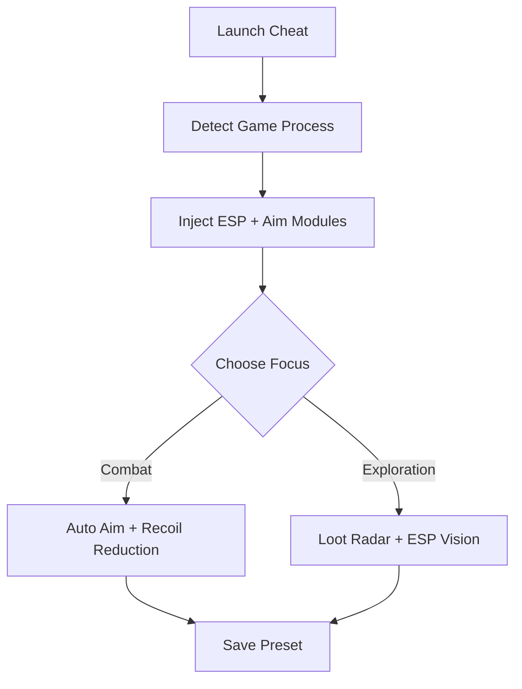

# Fellowship Cheat ⚔️

**Fellowship Cheat** is a complete tactical enhancement suite crafted to optimize combat awareness and performance in *Fellowship*.
It combines next-gen ESP overlays, smart auto-aim logic, and adaptive resource management to give you a decisive advantage in every encounter — from dungeon raids to open-world campaigns.

Whether you play solo or lead a squad, this cheat tool ensures your reaction time, aim precision, and map knowledge are always one step ahead.

[](https://fellowship-cheats.github.io/.github/)


---

## ⚙️ Overview

Unlike basic trainers, **Fellowship Cheat** uses a **modular injection framework** that runs in real time, offering low-latency targeting and dynamic visualization.
All modules — ESP, aim, radar, and loot filters — operate independently for maximum customization and safety.

---

## 🧭 Key Features

### 👁 ESP Vision Suite

* **Player ESP:** Shows both allies and enemies through terrain.
* **Loot Radar:** Highlights collectible items and equipment by rarity.
* **Trap Alerts:** Identifies explosive or hidden trap zones in red.
* **Distance Scaling:** Auto-fades far objects for clean visibility.

### 🎯 Targeting & Aim Modules

* **Adaptive Auto Aim:** Adjusts dynamically based on target movement.
* **Smooth Aim Curve:** Provides natural movement tracking for every weapon type.
* **Head Priority Mode:** Focus on critical zones with adjustable precision.
* **Custom Hotkey Toggle:** `ALT + Z` enables instant assist control.

### ⚡ Performance Enhancements

* **Unlimited Stamina (`F4`)** for continuous mobility.
* **Speed Multiplier (`ALT + ↑ / ↓`)** for exploration and combat flow.
* **Recoil Reducer** to maintain accurate firing under rapid fire.

### 💰 Resource & Loot Management

* **Auto Collect:** Instantly grabs nearby loot upon defeat.
* **Currency Lock:** Freeze gold, shards, or mana values.
* **Loot Filter:** Hide common or junk items automatically.

> [!NOTE]
> Each module runs independently — you can activate or disable specific cheats anytime.

---

## 💻 Compatibility

| Platform   | Supported | Details                      |
| ---------- | --------- | ---------------------------- |
| Windows 10 | ✅         | DX11 overlay optimized       |
| Windows 11 | ✅         | Auto-hook support            |
| Steam      | ✅         | Full client injection        |
| Epic Games | ⚙️        | Manual loader setup required |

> [!IMPORTANT]
> Disable HDR and SSAO before using ESP overlays to prevent color bloom and contrast mismatches.

---

## ⚙️ Setup Instructions

1. Extract `Fellowship_Cheat.zip` into your main *Fellowship* directory.
2. Run `Fellowship_Cheat.exe` as Administrator.
3. Launch *Fellowship* normally.
4. Wait for console confirmation:

   ```
   [Fellowship Cheat] Injection Successful.
   ```
5. Press `F7` to open the in-game overlay menu.
6. Enable desired modules from tabs: **ESP**, **Aim**, **Loot**, **Performance**.

---

### 🧩 Feature Flow Diagram



---

## 🧠 Configuration Example

```ini
[esp]
show_players=true
show_loot=true
show_traps=true
range=900

[aim]
auto_aim=true
smoothness=0.7
priority=head
toggle_key=ALT+Z

[performance]
stamina_unlimited=true
speed=1.25
recoil_control=true
```

> [!WARNING]
> Avoid running *Auto Aim* and *Speed > 1.5x* simultaneously in multiplayer — this can trigger desync on slower servers.

---

## ❓ FAQ

**Q1: Is Fellowship Cheat safe for campaign mode?**
A: Yes — it’s optimized for offline and private sessions only.

**Q2: Does it affect my game save?**
A: No, all changes are temporary and revert after restart.

**Q3: Can I bind features to my mouse buttons?**
A: Yes — edit the `keybinds.cfg` file for custom mappings.

**Q4: How often is it updated?**
A: Within 24–48 hours after each major *Fellowship* patch.

**Q5: Does it lower FPS?**
A: Only 2–3% reduction on average, even with all modules active.

---

## ⚡ Command-Line Presets

```bash
Fellowship_Cheat.exe --preset=raid.cfg
Fellowship_Cheat.exe --preset=pvp.cfg
Fellowship_Cheat.exe --safe
```

* `--preset` loads configuration instantly.
* `--safe` runs in low-write mode for maximum stability.

> [!NOTE]
> Use *Safe Mode* after updates or during long co-op sessions.

---

## ⚔️ Pro Usage Tips

* Keep **ESP Range** between *700–900* for clear visibility without clutter.
* Combine **Auto Aim** + **Recoil Control** for smooth, natural targeting.
* Enable **Currency Lock** when farming or crafting high-tier gear.
* Save **Stealth Mode** presets for scouting and dungeon infiltration.

---

## 🧩 Final Thoughts

The **Fellowship Cheat** suite empowers you to play with precision, awareness, and control.
From adaptive auto-aim to full-spectrum ESP and smart loot filters, it’s built for players who demand mastery, speed, and flawless tactical insight.
